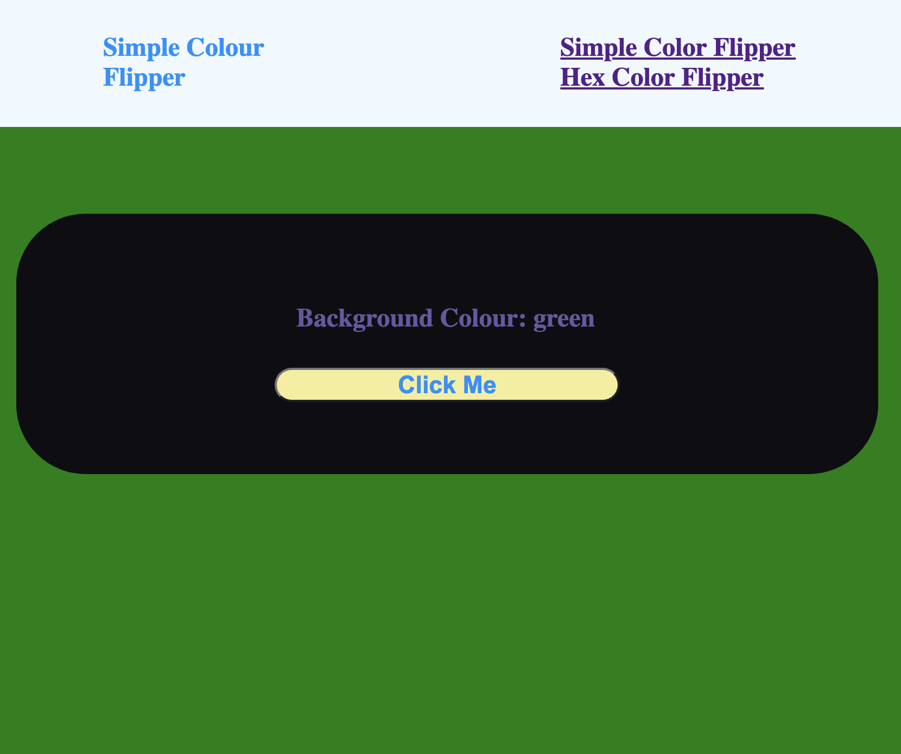
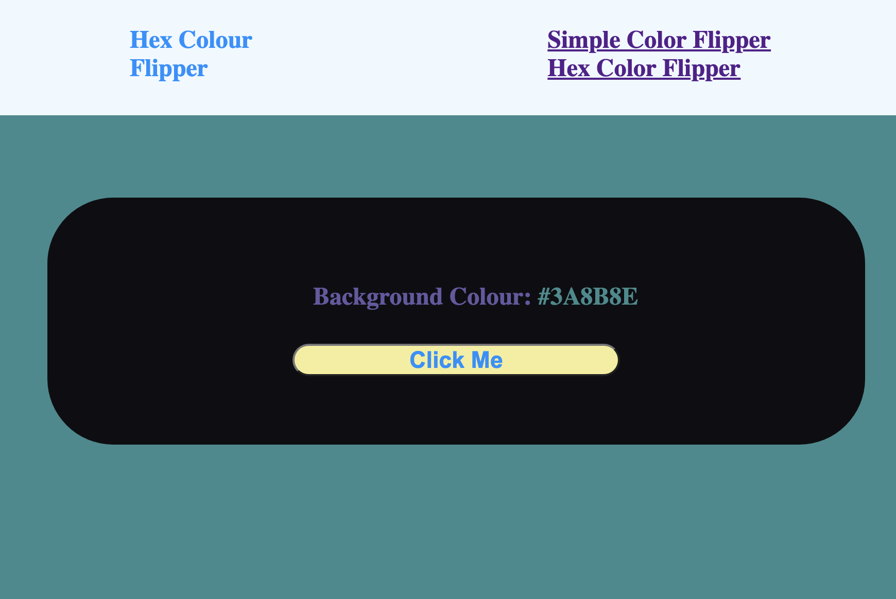

# Color Flipper App

## Description

This is a simple background colour changing app consisting of two pages created using HTML, CSS and JavaScript.

## How to Use the App

The first page of the app is the "Simple Colour Flipper". This has a pre-defined set of four background colour options ("green", "red", "rgba(133,122,200)", "#f15025") that are selected at random when the "Click Me" button is pressed. The background colour of the page is updated to match the randomised selection and the name of the selection is displayed.

The second page "Hex Colour Flipper" generates a completely random hex value. When the "Click Me" button is pressed the background colour of the page is updated to match the randomised selection and the name of the selection is displayed.

## Issues

- Uncaught TypeError: Cannot read properties of null (reading 'addEventListener')
  - resolved issue by adding 'async' attribute to the script source tags at the start of the page to ensure the page had fully loaded prior to running the script
